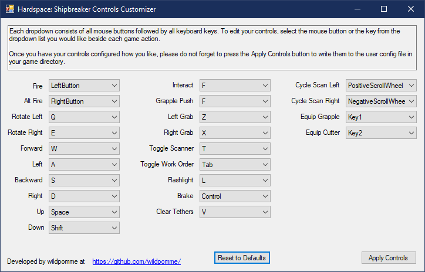

# shipbreaker-custom-controls
This tool provides a user interface for editing the controls of the game.

It uses one library to perform its functions:

INI-Parser: https://github.com/rickyah/ini-parser

Download the the zip file of the most recent version from the releases page.
You can unzip it wherever you want. Then to use the tool, open Shipbreaker-Custom-Controls.exe with a double click.
Once open, it will read in your current configuration, and then you can change it however you like. Don't forget
to press apply.

Here's an example of what the tool looks like:

